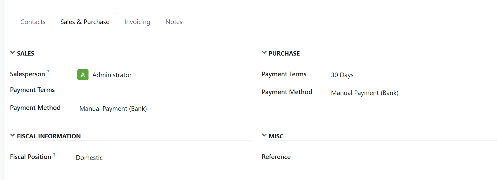
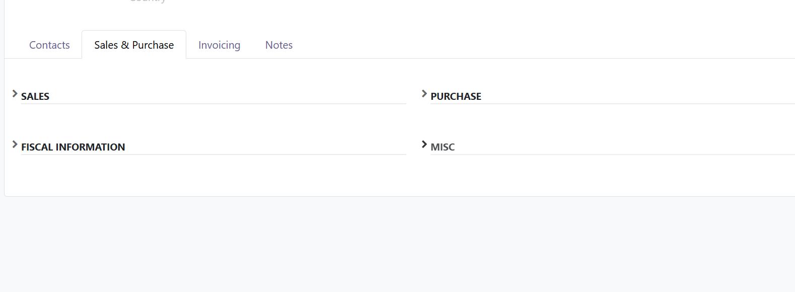

To use this module:

1. Install the module
2. Open any form view with groups that have labels
3. Click on the group title or chevron icon to toggle

Any group with a ``string`` attribute will automatically have collapse/expand functionality.

Screenshots
-----------

Groups in opened state:

Groups in closed state:

Example
-------

.. code-block:: xml

    <group string="Contact Information">
        <field name="email"/>
        <field name="phone"/>
    </group>

The "Contact Information" group will display a chevron icon next to the title.
Click anywhere on the title area to collapse or expand the group content.
